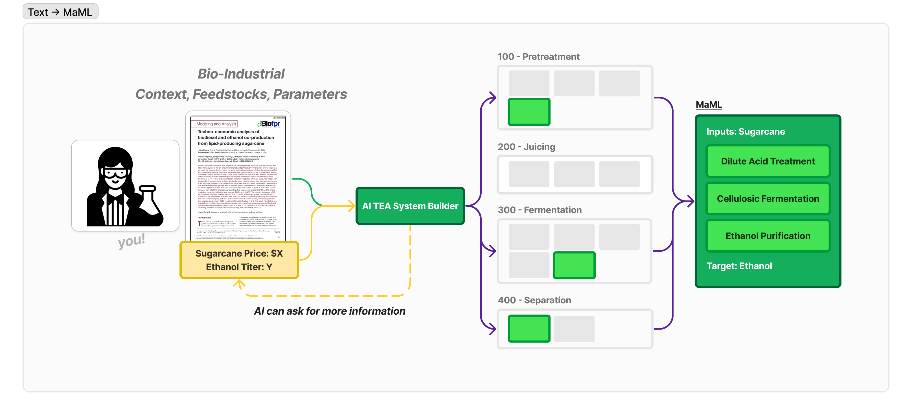
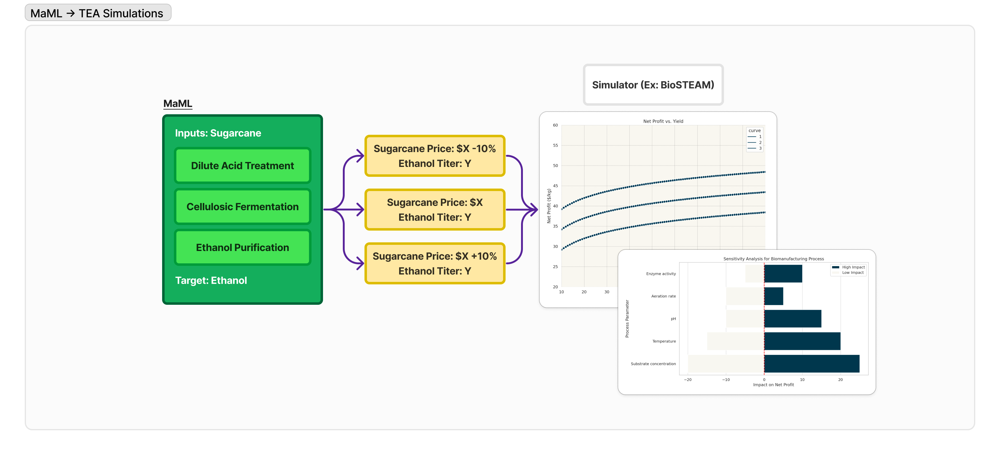

### AI-TEAs

# Automated Techno-Economic Analysis (TEA) using Manufacturing MarkUp Language (MaML)

##### [Homeworld Collective](https://homeworld.bio/) -- Kyle Barnes, Daniel Goodwin, Mark Hansen

**Problem:** Scientists are exceptional at solving challenges in their domain and demonstrating possibilities at the bench. Deployments to the field however come with many variables, often beyond the training and scope of what a scientist. 

**Concept:** Utilizing LLMs, we can find and parse existing technoeconomic analysis literature to help guide researchers in full technoeconomic analysis (TEA). To standardize how we talk about these industrial processees, we've proposed a standard *Manufacturing Markup Language (MaML)*.

## Approach: Exploring Corn to Ethanol Production

To explore this idea, we built our code to evaluate different processes and variables involved in the production of ethanol from corn and sugar cane, a well studied industrial process in the United States.

Our demo of an LLM-driven workflow has 4 distinct sections:
- Knowledge Management (ex: paper management, open-ended text input)
- Generating *Manufacturing Markup Language* (MaML) for a given query/exploration
- Executing TEA Simulations with varying parameters and fidelity (Lvl 1: LLM function writing <> Lvl 7: BioSTEAM)
- MaML & TEA Simulation Results Viewing

In this respository, you'll find distinct code directories for each section/role.

## Demo Setup & Run

Before running the repository's demo code, do the following:
- Install dependencies via `pip install -r requirements.txt`
- Sign up for an [OpenAI API key](https://platform.openai.com/)
- Create a `.env` file in the root of this repository, with the env variable and secret `OPENAI_API_KEY=abcdef`

To evaluate some sample paper text, generate related MaMLs, and simulate TEAs, run at the roof: `python demo.py`

## Explore: Generating MaMLs

**Overview**: Our MaML structure is quite simple: input feedstock, output target product, and processing flow steps each with their own inputs, outputs, and parameters describing the step and its work. These are iteratively constructed, by prompts first describing high level process decisions, before iteratively going through and evaluating inputs/outputs.

To guide the LLM, we provide in-context examples, a range of enums describing industrial processes, and Department of Energy tags so we can tie processes back to formal language/datasets used in federal agencies.

**Learnings**: After exploring hundreds of TEA papers we found publicly, we found that literature still was narrowly focused on specific steps in an inudstrial process. In reality, it takes a broader review than nearly all papers take.

LLMs can be valuable for filling in process gaps, but ensuring consistency in process step attributes be monitored and enforced. We did this by providing a dictionary of possible processing steps (ex: for pretreatment, `pretreatment.hot_water_pretreatment`, `pretreatment.dilute_acid_pretreatment`, etc.)

**Future Explorations**: After we built our code to handle paper analysis and the gaps we were seeing in literature, we realized we could allow an extensive description from a user and generate comparable if not better MaMLs for a user's use case because it can fully describe a real world scenario and stages which doesn't happen as often in literature.

We also think that the process of generating a MaML can be an interactive and cycling process than 1 shot, allowing for a richer processing details.

## Explore: Automating Techno-Economic Analysis

**Overview**: With a consistent structure and defintions, we can do a range of techno-economic analyses with different input parameters. In our demo, we actual generate a range of parameter values, simulating different scenarios of feedstock and energy prices. These TEA "simulations" are done in two ways.

The TEA "level 1s" are high level, where we utilize LLMs to write python code to return some ouptut target_product given an input and process step paramters alongside the processing context. At the end, we can generate a high level CSV outlining the process flow steps and their inputs/outputs.

The TEA "level 7s" utilize chemical engineering simulation packages, in our case BioSTEAM, for generating detailed processing simulations. Our stricter set of enums can guide our code to build a "simulation mesh" for running an extremely thorough analysis. At the end, we can generate a process flow mermaid chart.

**Learnings**: Economic evaluations require many factors beyond the products touched by an invention, like capex investments, energy costs, and wastewater treatment. Sometimes ideas can be written off with early back of the napkin math while others take an extensive look at unit economics given several commodity prices.

To tackle that variability, we setup the varying "levels" of TEA analysis, but deep technical analysis at chemical engineering levels still requires many assumptions.

**Future Explorations**: Bringing together generative tooling and chemical engineering packages, can open up a new way to explore and industrial processing flows. We see a future where an iterative process with the researcher in the loop can both enrich TEA analysis and help guide users to new ideas.
